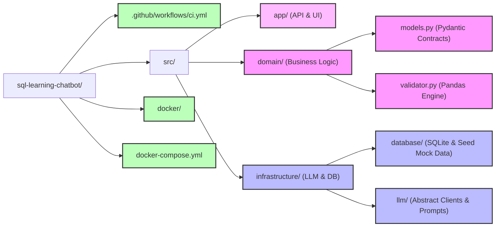
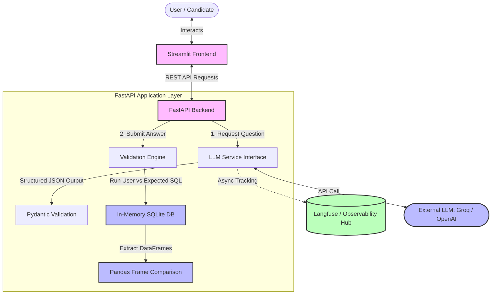
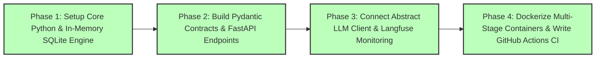

# sql-agent-interviewer
A production-ready GenAI &amp; MLOps platform featuring an adaptive SQL interview coach for Data Engineering candidates. Built with FastAPI, Streamlit, and SQLite (in-memory execution), the system leverages structured LLM outputs to progressively adjust question difficulty based on user performance.

## 1. Repository File Structure

## 2. Data Flow & Production Architecture

## 3. Development & CI/CD Sequence

